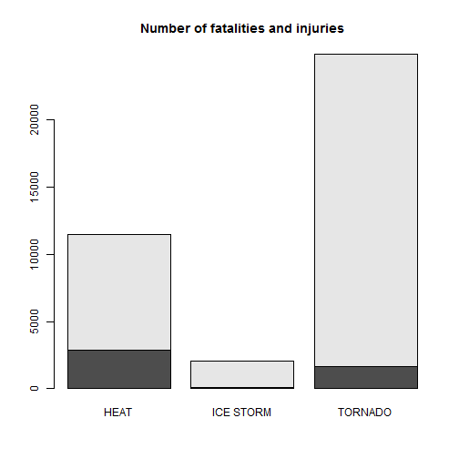
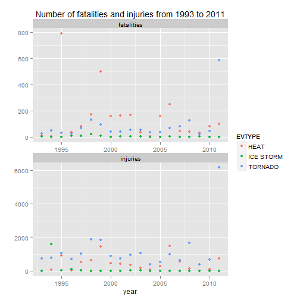
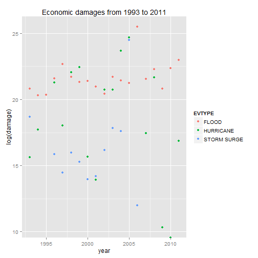

# Heat and tornados most dangerous to population health, floods with the greatest economic consequences

In this report the consequences of severe weather events are analysed. The analysis uses the U.S. National Oceanic and Atmospheric Administration's (NOAA) storm database, specifically data from 1993 to 2011. It is found that heat and tornados have caused most fatalities and injuries whereas floods have caused the highest property damages.

## Data Processing

At first the necessary packages are loaded.

```r
library(lubridate)
```

```
## Warning: package 'lubridate' was built under R version 3.1.2
```

```r
library(dplyr)
```

```
## Warning: package 'dplyr' was built under R version 3.1.2
```

```r
library(sqldf)
```

```
## Warning: package 'sqldf' was built under R version 3.1.2
```

```
## Warning: package 'gsubfn' was built under R version 3.1.2
```

```
## Warning: package 'proto' was built under R version 3.1.2
```

```
## Warning: package 'RSQLite' was built under R version 3.1.2
```

```
## Warning: package 'DBI' was built under R version 3.1.2
```

```r
library(ggplot2)
```

```
## Warning: package 'ggplot2' was built under R version 3.1.2
```

```r
library(reshape2)
```

```
## Warning: package 'reshape2' was built under R version 3.1.2
```

The file is downloaded and loaded into R. Afterwards the columns that are relevant for the analysis - BGN_DATE, STATE, EVTYPE, FATALITIES, INJURIES, PROPDMG, PROPDMGEXP, CROPDMG and CROPDMGEXP - are extracted.


```r
url <- "http://d396qusza40orc.cloudfront.net/repdata%2Fdata%2FStormData.csv.bz2"
data <- read.csv("StormData")
data<-data[,c("BGN_DATE","STATE","EVTYPE","FATALITIES","INJURIES","PROPDMG","PROPDMGEXP","CROPDMG","CROPDMGEXP")]

str(data)
```

```
## 'data.frame':	902297 obs. of  9 variables:
##  $ BGN_DATE  : Factor w/ 16335 levels "1/1/1966 0:00:00",..: 6523 6523 4242 11116 2224 2224 2260 383 3980 3980 ...
##  $ STATE     : Factor w/ 72 levels "AK","AL","AM",..: 2 2 2 2 2 2 2 2 2 2 ...
##  $ EVTYPE    : Factor w/ 985 levels "   HIGH SURF ADVISORY",..: 834 834 834 834 834 834 834 834 834 834 ...
##  $ FATALITIES: num  0 0 0 0 0 0 0 0 1 0 ...
##  $ INJURIES  : num  15 0 2 2 2 6 1 0 14 0 ...
##  $ PROPDMG   : num  25 2.5 25 2.5 2.5 2.5 2.5 2.5 25 25 ...
##  $ PROPDMGEXP: Factor w/ 19 levels "","-","?","+",..: 17 17 17 17 17 17 17 17 17 17 ...
##  $ CROPDMG   : num  0 0 0 0 0 0 0 0 0 0 ...
##  $ CROPDMGEXP: Factor w/ 9 levels "","?","0","2",..: 1 1 1 1 1 1 1 1 1 1 ...
```

The column BGN_DATE is converted into a date variable.


```r
data$BGN_DATE <- mdy_hms(data$BGN_DATE)
```

According to the data description the column PROPDMGEXP contains the values H (=hundred), K (=thousend), M (=million) and B (=billion). 
We have a look at the values of PROPDMGEXP and how often they occur.


```r
data %>% group_by(PROPDMGEXP) %>% summarize(total = n())
```

```
## Source: local data frame [19 x 2]
## 
##    PROPDMGEXP  total
## 1             465934
## 2           -      1
## 3           ?      8
## 4           +      5
## 5           0    216
## 6           1     25
## 7           2     13
## 8           3      4
## 9           4      4
## 10          5     28
## 11          6      4
## 12          7      5
## 13          8      1
## 14          B     40
## 15          h      1
## 16          H      6
## 17          K 424665
## 18          m      7
## 19          M  11330
```

Obviously not only H, K, M and B occur, but also numbers. These numbers occur at the following dates:


```r
data$BGN_DATE[grep("[1-8]",data$PROPDMGEXP)]
```

```
##  [1] "1994-08-13 UTC" "1995-02-08 UTC" "1995-06-07 UTC" "1995-04-04 UTC"
##  [5] "1995-05-12 UTC" "1995-05-27 UTC" "1995-06-20 UTC" "1995-05-27 UTC"
##  [9] "1995-06-20 UTC" "1995-06-08 UTC" "1995-05-18 UTC" "1995-05-18 UTC"
## [13] "1995-05-18 UTC" "1995-05-27 UTC" "1995-06-23 UTC" "1995-04-08 UTC"
## [17] "1995-06-07 UTC" "1995-06-07 UTC" "1994-09-07 UTC" "1995-07-28 UTC"
## [21] "1995-06-08 UTC" "1995-06-07 UTC" "1995-05-16 UTC" "1995-05-16 UTC"
## [25] "1995-05-27 UTC" "1995-05-15 UTC" "1995-07-04 UTC" "1993-12-08 UTC"
## [29] "1995-06-21 UTC" "1994-08-18 UTC" "1995-05-18 UTC" "1995-04-13 UTC"
## [33] "1995-05-18 UTC" "1995-05-10 UTC" "1995-05-10 UTC" "1995-05-10 UTC"
## [37] "1995-05-10 UTC" "1995-05-18 UTC" "1995-05-18 UTC" "1995-05-14 UTC"
## [41] "1995-05-10 UTC" "1995-05-18 UTC" "1995-05-18 UTC" "1995-05-18 UTC"
## [45] "1995-05-14 UTC" "1995-05-18 UTC" "1995-05-18 UTC" "1995-05-09 UTC"
## [49] "1995-05-18 UTC" "1995-05-18 UTC" "1995-05-18 UTC" "1995-05-18 UTC"
## [53] "1995-05-18 UTC" "1995-05-18 UTC" "1995-05-18 UTC" "1995-05-18 UTC"
## [57] "1995-05-18 UTC" "1995-05-18 UTC" "1995-05-18 UTC" "1995-05-10 UTC"
## [61] "1995-05-18 UTC" "1995-05-26 UTC" "1995-05-26 UTC" "1995-05-18 UTC"
## [65] "1995-05-18 UTC" "1995-05-09 UTC" "1995-05-18 UTC" "1995-05-18 UTC"
## [69] "1995-05-18 UTC" "1995-05-14 UTC" "1995-05-09 UTC" "1995-05-18 UTC"
## [73] "1995-05-18 UTC" "1995-05-18 UTC" "1995-05-18 UTC" "1995-05-18 UTC"
## [77] "1995-05-10 UTC" "1995-05-10 UTC" "1995-05-18 UTC" "1995-05-17 UTC"
## [81] "1995-03-11 UTC" "1995-03-11 UTC" "1995-07-27 UTC" "1995-06-22 UTC"
```

We can ignore these false values for now as they only occur between 1993 and 1995. Therefore only datasets with correct values in PROPDMGEXP and CROPDMGEXP are considered for the analysis.


```r
data <- sqldf('select * from data 
              where PROPDMGEXP in ("","B","b","h","H","k","K","m","M")
              and CROPDMGEXP in ("", "B", "k","K","m","M")')
```

```
## Loading required package: tcltk
```

The values in PROPDMG and CROPDMG are multiplied by the respective value according to PROPDMGEXP and CROPDMGEXP so that the value of PROPDMG and CROPDMG are of the same unit.


```r
data$PROPDMG[grep("[hH]",data$PROPDMGEXP)]<-data$PROPDMG[grep("[hH]",data$PROPDMGEXP)]*100
data$PROPDMG[grep("[kK]",data$PROPDMGEXP)]<-data$PROPDMG[grep("[kK]",data$PROPDMGEXP)]*1000
data$PROPDMG[grep("[mM]",data$PROPDMGEXP)]<-data$PROPDMG[grep("[mM]",data$PROPDMGEXP)]*1000000
data$PROPDMG[grep("[bB]",data$PROPDMGEXP)]<-data$PROPDMG[grep("[bB]",data$PROPDMGEXP)]*1000000000

data$CROPDMG[grep("[hH]",data$CROPDMGEXP)]<-data$CROPDMG[grep("[hH]",data$CROPDMGEXP)]*100
data$CROPDMG[grep("[kK]",data$CROPDMGEXP)]<-data$CROPDMG[grep("[kK]",data$CROPDMGEXP)]*1000
data$CROPDMG[grep("[mM]",data$CROPDMGEXP)]<-data$CROPDMG[grep("[mM]",data$CROPDMGEXP)]*1000000
data$CROPDMG[grep("[bB]",data$CROPDMGEXP)]<-data$CROPDMG[grep("[bB]",data$CROPDMGEXP)]*1000000000
```

We also check in which year the event types were first recorded to see if there are differences over the decades.


```r
event_minyear <- data%>%mutate(year=year(BGN_DATE))%>%group_by(EVTYPE)%>%summarize(min_year=min(year))%>%arrange(min_year)
head(event_minyear,n=100)
```

```
## Source: local data frame [100 x 2]
## 
##                       EVTYPE min_year
## 1                    TORNADO     1950
## 2                       HAIL     1955
## 3                  TSTM WIND     1955
## 4                   AVALANCE     1993
## 5                  AVALANCHE     1993
## 6                   BLIZZARD     1993
## 7      BLIZZARD/WINTER STORM     1993
## 8               BLOWING SNOW     1993
## 9              COASTAL FLOOD     1993
## 10          COASTAL FLOODING     1993
## 11             COASTAL SURGE     1993
## 12       COASTAL/TIDAL FLOOD     1993
## 13                      COLD     1993
## 14          COLD AIR FUNNELS     1993
## 15                COLD/WINDS     1993
## 16              COOL AND WET     1993
## 17                 DENSE FOG     1993
## 18                   DROUGHT     1993
## 19           DRY HOT WEATHER     1993
## 20                DUST DEVIL     1993
## 21                DUST STORM     1993
## 22              EARLY FREEZE     1993
## 23               EARLY FROST     1993
## 24              EXTREME COLD     1993
## 25               FLASH FLOOD     1993
## 26    FLASH FLOOD LANDSLIDES     1993
## 27              FLASH FLOOD/     1993
## 28         FLASH FLOOD/FLOOD     1993
## 29            FLASH FLOODING     1993
## 30              FLASH FLOODS     1993
## 31                     FLOOD     1993
## 32              FLOOD WATCH/     1993
## 33         FLOOD/FLASH FLOOD     1993
## 34          FLOOD/FLASHFLOOD     1993
## 35         FLOOD/RIVER FLOOD     1993
## 36                  FLOODING     1993
## 37                    FLOODS     1993
## 38                    FREEZE     1993
## 39             FREEZING RAIN     1993
## 40                     FROST     1993
## 41             FROST\\FREEZE     1993
## 42              FUNNEL CLOUD     1993
## 43             FUNNEL CLOUDS     1993
## 44           GROUND BLIZZARD     1993
## 45               GUSTY WINDS     1993
## 46                HAIL 1.75)     1993
## 47                      HEAT     1993
## 48           HEAVY LAKE SNOW     1993
## 49                HEAVY RAIN     1993
## 50               HEAVY RAINS     1993
## 51                HEAVY SNOW     1993
## 52        HEAVY SNOW SQUALLS     1993
## 53  HEAVY SNOW/FREEZING RAIN     1993
## 54            HEAVY SNOW/ICE     1993
## 55           HEAVY SNOW/WIND     1993
## 56            HEAVY SNOWPACK     1993
## 57                HEAVY SURF     1993
## 58                 HIGH SEAS     1993
## 59                 HIGH SURF     1993
## 60                HIGH WATER     1993
## 61                 HIGH WIND     1993
## 62       HIGH WIND/ BLIZZARD     1993
## 63            HIGH WIND/SEAS     1993
## 64                HIGH WINDS     1993
## 65           HIGH WINDS/COLD     1993
## 66     HIGH WINDS/HEAVY RAIN     1993
## 67           HIGH WINDS/SNOW     1993
## 68           HOT/DRY PATTERN     1993
## 69                 HURRICANE     1993
## 70           HURRICANE EMILY     1993
## 71                       ICE     1993
## 72              ICE AND SNOW     1993
## 73                   ICE JAM     1993
## 74                 ICE STORM     1993
## 75        ICE STORM AND SNOW     1993
## 76          LAKE EFFECT SNOW     1993
## 77                LANDSLIDES     1993
## 78                 LIGHTNING     1993
## 79               MAJOR FLOOD     1993
## 80            MINOR FLOODING     1993
## 81                 MUD SLIDE     1993
## 82                  MUDSLIDE     1993
## 83                 MUDSLIDES     1993
## 84          NEAR RECORD SNOW     1993
## 85                      RAIN     1993
## 86                 RAIN/SNOW     1993
## 87                 RAINSTORM     1993
## 88               RECORD COLD     1993
## 89               RECORD HEAT     1993
## 90  RECORD HIGH TEMPERATURES     1993
## 91           RECORD RAINFALL     1993
## 92               RECORD SNOW     1993
## 93           RECORD SNOWFALL     1993
## 94             RECORD WARMTH     1993
## 95               RIVER FLOOD     1993
## 96            RIVER FLOODING     1993
## 97       ROTATING WALL CLOUD     1993
## 98      SEVERE THUNDERSTORMS     1993
## 99         SEVERE TURBULENCE     1993
## 100          SLEET/RAIN/SNOW     1993
```

As most event types were first recorded in 1993, the data is filtered for records from 1993 on.


```r
data <- data %>% mutate(year=year(BGN_DATE)) %>% filter(year>=1993)
```

## Results

### Events that are most harmful with respect to population health

We are interested in the sum of fatalities and injuries of each event across the United States. The 10 events with the most fatalities an injuries are reported.


```r
d <- sqldf('select EVTYPE, count(*) as [total number], sum(FATALITIES)+sum(INJURIES) as [Fatalities and injuries] 
      from data group by EVTYPE order by sum(FATALITIES)+sum(INJURIES) desc')
head(d,n=10)
```

```
##               EVTYPE total number Fatalities and injuries
## 1            TORNADO        25864                   24903
## 2     EXCESSIVE HEAT         1678                    8428
## 3              FLOOD        25325                    7259
## 4          LIGHTNING        15732                    6046
## 5          TSTM WIND       128976                    3872
## 6               HEAT          767                    3037
## 7        FLASH FLOOD        54261                    2755
## 8          ICE STORM         2005                    2064
## 9  THUNDERSTORM WIND        82559                    1621
## 10      WINTER STORM        11432                    1527
```

Not only the aboslute numbers of fatalities and injuries are important but also the relative ones (average). Here are the 10 events that have the highest risk for population health if they occur.


```r
d2<-sqldf('select EVTYPE, count(*) as [total number], (sum(FATALITIES)+sum(INJURIES))/count(*) as [averaged fatalities and injuries]
       from data group by EVTYPE having count(*)>100 order by (sum(FATALITIES)+sum(INJURIES  ))/count(*) desc')
head(d2,n=10)
```

```
##            EVTYPE total number averaged fatalities and injuries
## 1  EXCESSIVE HEAT         1678                        5.0226460
## 2            HEAT          767                        3.9595828
## 3    RIP CURRENTS          304                        1.6480263
## 4             FOG          538                        1.4795539
## 5     RIP CURRENT          470                        1.2765957
## 6      DUST STORM          427                        1.0819672
## 7       ICE STORM         2005                        1.0294264
## 8       AVALANCHE          386                        1.0207254
## 9         TORNADO        25864                        0.9628441
## 10      HURRICANE          174                        0.6149425
```

We can see that the events TORNADO, EXCESSIVE HEAT, HEAT and ICE STORM cause most fatalities and injuries in terms of total numbers as well as averaged numbers if they occur.

EXCESSIVE HEAT and HEAT can - for the purpose of this analysis - be regarded as the same kind of event and therefore be summarized. 
The event EXCESSIVE HEAT will be replaced in the data set by HEAT.

```r
data$EVTYPE<-gsub("EXCESSIVE HEAT","HEAT",data$EVTYPE,fixed=TRUE)
```

The analysis above that gives the top ten events is now repeated.


```r
d <- sqldf('select EVTYPE, count(*) as [total number], sum(FATALITIES)+sum(INJURIES) as [Fatalities and injuries] 
      from data group by EVTYPE order by sum(FATALITIES)+sum(INJURIES) desc')
head(d,n=10)
```

```
##               EVTYPE total number Fatalities and injuries
## 1            TORNADO        25864                   24903
## 2               HEAT         2445                   11465
## 3              FLOOD        25325                    7259
## 4          LIGHTNING        15732                    6046
## 5          TSTM WIND       128976                    3872
## 6        FLASH FLOOD        54261                    2755
## 7          ICE STORM         2005                    2064
## 8  THUNDERSTORM WIND        82559                    1621
## 9       WINTER STORM        11432                    1527
## 10         HIGH WIND        20210                    1383
```

```r
d2<-sqldf('select EVTYPE, count(*) as [total number], (sum(FATALITIES)+sum(INJURIES))/count(*) as [averaged fatalities and injuries]
       from data group by EVTYPE having count(*)>100 order by (sum(FATALITIES)+sum(INJURIES  ))/count(*) desc')
head(d2,n=10)
```

```
##          EVTYPE total number averaged fatalities and injuries
## 1          HEAT         2445                        4.6891616
## 2  RIP CURRENTS          304                        1.6480263
## 3           FOG          538                        1.4795539
## 4   RIP CURRENT          470                        1.2765957
## 5    DUST STORM          427                        1.0819672
## 6     ICE STORM         2005                        1.0294264
## 7     AVALANCHE          386                        1.0207254
## 8       TORNADO        25864                        0.9628441
## 9     HURRICANE          174                        0.6149425
## 10 EXTREME COLD          655                        0.5969466
```

Now the events HEAT, TORNADO and ICE STORM can be identified as the ones that

1. occur very often and

2. bear high risks for human health *when* they occur as the averaged numbers of fatalities and injuries is very high.

The follwing table and graph show the total number of fatalities and injuries for these three events from 1993 to 2011.

```r
d3<-data%>%filter(EVTYPE=="HEAT"|EVTYPE=="TORNADO"|EVTYPE=="ICE STORM")%>%group_by(EVTYPE)%>%summarize(fatalities=sum(FATALITIES),injuries=sum(INJURIES))
d3
```

```
## Source: local data frame [3 x 3]
## 
##      EVTYPE fatalities injuries
## 1      HEAT       2840     8625
## 2 ICE STORM         89     1975
## 3   TORNADO       1618    23285
```

```r
m<-as.matrix(d3)
barplot(t(m)[2:3,],names.arg=m[,1],main="Number of fatalities and injuries")
```

 

**Heat** has caused **most fatalities**, **tornados most injuries**.

The following figure shows a time series of the number of fatalities and injuries for the three selected events.


```r
d4<-data%>%filter(EVTYPE=="HEAT"|EVTYPE=="TORNADO"|EVTYPE=="ICE STORM")%>%
            mutate(year=year(BGN_DATE))%>%group_by(EVTYPE,year)%>%
            summarize(fatalities=sum(FATALITIES),injuries=sum(INJURIES))

d4.melt<-melt(d4,id=c("year","EVTYPE"),measure.vars=c("fatalities","injuries"))

g<-ggplot(d4.melt,aes(year,value))+geom_point(aes(color=EVTYPE))+
  facet_wrap(~variable,nrow=2,scales="free")+
  labs(title="Number of fatalities and injuries from 1993 to 2011",y="")
print(g)
```

 


### Events that have the greatest economic consequences

We are interested in the sum of PROPDMG and CROPDMG of each event across the United States. The 10 events with the highest damages are reported.


```r
d5 <- data%>%group_by(EVTYPE)%>%
            summarize(total=n(),damage=sum(PROPDMG+CROPDMG))%>%arrange(desc(damage))
head(d5,n=10)
```

```
## Source: local data frame [10 x 3]
## 
##               EVTYPE  total       damage
## 1              FLOOD  25325 150319678257
## 2  HURRICANE/TYPHOON     88  71913712800
## 3        STORM SURGE    261  43323541000
## 4            TORNADO  25864  26703737023
## 5               HAIL 226794  18733216730
## 6        FLASH FLOOD  54261  17561538817
## 7            DROUGHT   2487  15018672000
## 8          HURRICANE    174  14610229010
## 9        RIVER FLOOD    173  10148404500
## 10         ICE STORM   2005   8967037810
```

The events HURRICANE and HURRICANE/TYPHOON can - for the purpose of this analysis - be regarded es the same kind of event, as well as FLOOD and FLASH FLOOD. Therefore HURRICANE/TYPHOON is replaced bey HURRICANE and FLASH FLOOD by FLOOD.


```r
data$EVTYPE<-gsub("HURRICANE/TYPHOON","HURRICANE",data$EVTYPE,fixed=TRUE)
data$EVTYPE<-gsub("FLASH FLOOD","FLOOD",data$EVTYPE,fixed=TRUE)
```

Now the top ten events in terms of property damage are:


```r
d5 <- data%>%group_by(EVTYPE)%>%
            summarize(total=n(),damage=sum(PROPDMG+CROPDMG))%>%arrange(desc(damage))
head(d5,n=10)
```

```
## Source: local data frame [10 x 3]
## 
##            EVTYPE  total       damage
## 1           FLOOD  79586 167881217074
## 2       HURRICANE    262  86523941810
## 3     STORM SURGE    261  43323541000
## 4         TORNADO  25864  26703737023
## 5            HAIL 226794  18733216730
## 6         DROUGHT   2487  15018672000
## 7     RIVER FLOOD    173  10148404500
## 8       ICE STORM   2005   8967037810
## 9  TROPICAL STORM    690   8382236550
## 10   WINTER STORM  11432   6715441250
```

We discover that **floods** have caused the **greatest property** damages from 1993 to 2011.

The following figure shows a time series of the sum of PROPDMG and CROPDMG for the three selected events with the highest total damages: FLOOD, HURRICANE and STORM SURGE. We take the log of the damage to adjust for skew in the data.


```r
d7<-data%>%filter(EVTYPE=="FLOOD"|EVTYPE=="HURRICANE"|EVTYPE=="STORM SURGE")%>%
            mutate(year=year(BGN_DATE))%>%group_by(EVTYPE,year)%>%
            summarize(damage=sum(CROPDMG+PROPDMG))

g<-ggplot(d7,aes(year,log(damage)))+geom_point(aes(color=EVTYPE))+
          labs(title="Economic damages from 1993 to 2011")
print(g)
```

 
